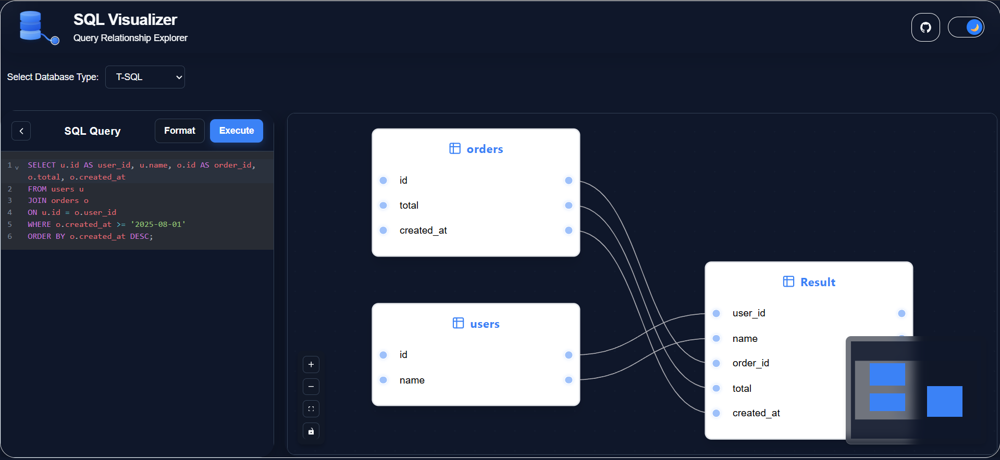

# SQL Visualizer

A modern interactive tool to visualize SQL queries as relationship graphs.

---

## Overview

SQL Visualizer converts SQL queries into an interactive graph representation, making it easier to understand:

- Table relationships
- JOIN operations
- Selected columns
- Query structure
- Data flow between tables

This tool is especially useful for:

- Learning SQL
- Debugging complex queries
- Understanding large JOIN chains
- Database documentation
- Query analysis and optimization

---

## How It Works

The visualization pipeline follows a compiler-inspired architecture:

1. SQL Query Input
2. SQL Parsing
3. Abstract Syntax Tree (AST) Generation
4. AST Traversal
5. Graph Data Structure Creation
6. Interactive Visualization

The parser converts the SQL query into an **Abstract Syntax Tree (AST)** — similar to the parsing phase used in compilers.

The AST is then transformed into graph nodes and edges which are rendered visually using React Flow.

---

## Tech Stack

### Frontend

- React
- TypeScript
- Tailwind CSS
- React Flow

### SQL Parsing

- node-sql-parser

---

## Features

- Interactive SQL graph visualization
- Multiple SQL dialect support
- AST-based query analysis
- Table relationship mapping
- JOIN visualization
- Column highlighting
- Responsive UI
- Dark mode support

---

## Supported SQL Constructs

- SELECT
- INNER JOIN
- LEFT JOIN
- RIGHT JOIN
- WHERE clauses
- ORDER BY
- Aliases
- Multiple table joins

---

## Example

### SQL Query

```sql
SELECT 
    u.id AS user_id,
    u.name,
    o.id AS order_id,
    o.total
FROM users u
JOIN orders o
ON u.id = o.user_id
WHERE o.total > 100;
```

### Visualization

The query is transformed into:

- Table nodes
- Column nodes
- Relationship edges
- JOIN mappings

---

## Installation

```bash
git clone <your-repo-url>
cd sql-visualizer
npm install
npm run dev
```

---

## Project Architecture

```text
SQL Query
    ↓
node-sql-parser
    ↓
AST (Abstract Syntax Tree)
    ↓
Custom AST Parser
    ↓
Graph Data Structure
    ↓
React Flow Renderer
```

---

## Future Improvements

Planned features:

- Create and INSERT Query Support
- Condition edges
- Edge tooltips for conditions/functions
- Aggregation visualization
- Subquery visualization
- Query execution flow
- Export diagrams as PNG/SVG
- Minimap and graph controls
- SQL formatting improvements
- Query performance insights

---

## Why This Project?

Understanding complex SQL queries through plain text can be difficult.

This project aims to make SQL more visual and intuitive by transforming query logic into interactive relationship diagrams.

---

## Contributing

Contributions are welcome.

Ideas, bug reports, and pull requests are appreciated.

---

## License

MIT License

---

## Screenshots

